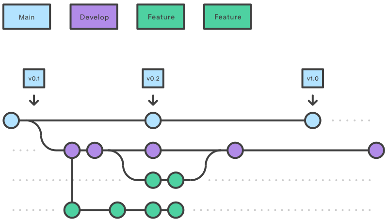
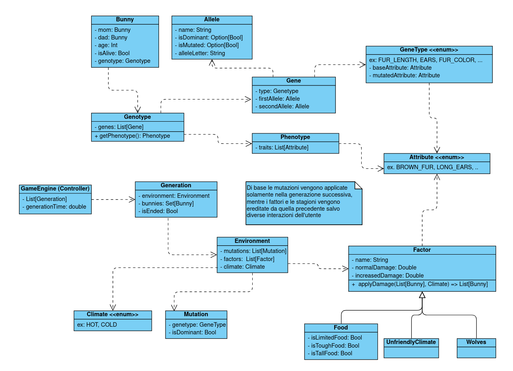
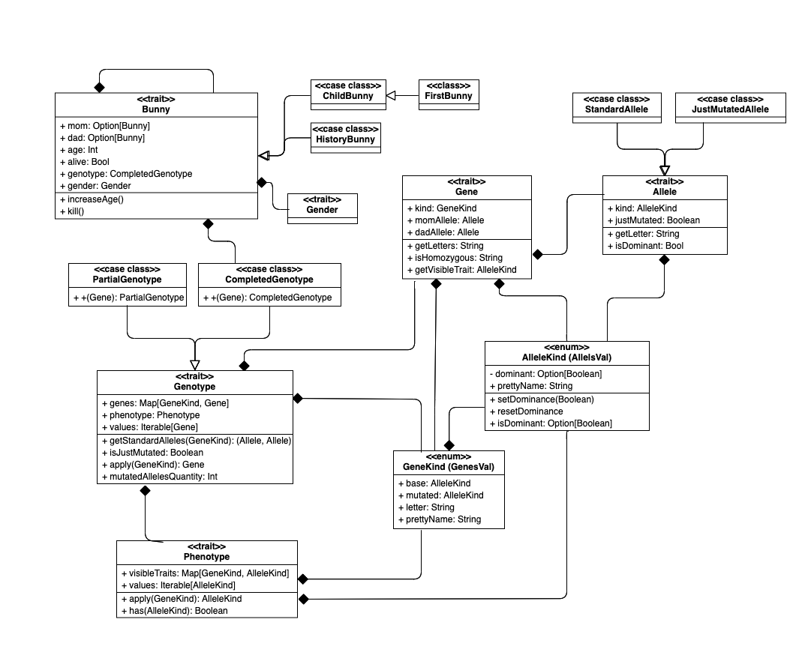
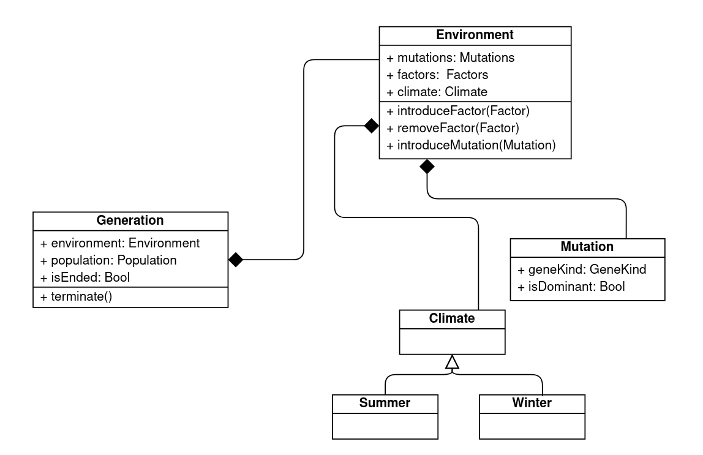
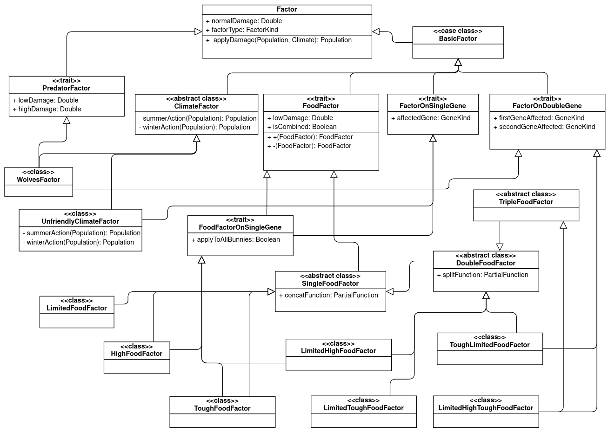
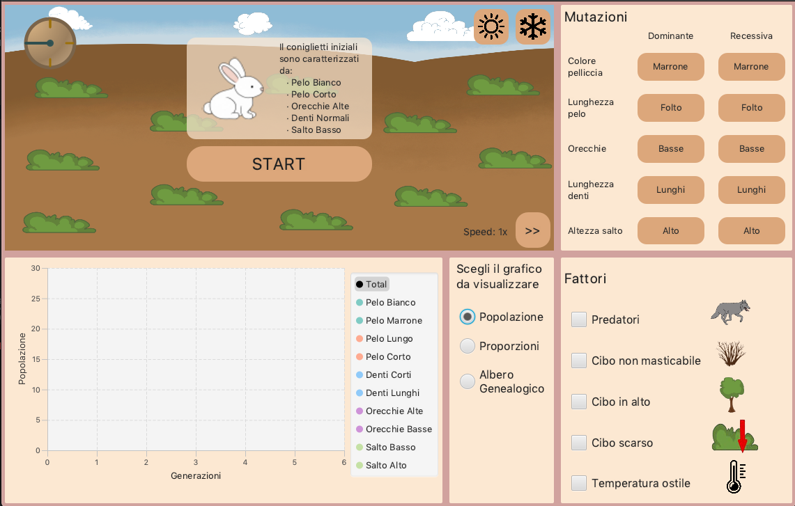

# PPS-BUNNY

[Baiardi Martina](mailto:martina.baiardi4@studio.unibo.it),
[Lucchi Asia](mailto:asia.lucchi@studio.unibo.it),
[Spadoni Marta](mailto:marta.spadoni2@studio.unibo.it),
[Rocco Alessia](mailto:alessia.rocco@studio.unibo.it)

## Introduzione

`pps-bunny` è un simulatore che permette di osservare la selezione naturale di una popolazione di conigli nel corso delle generazioni.  
É possibile influenzare l'evoluzione attraverso alcuni fattori disturbanti: la variazione delle condizioni ambientali, la presenza di predatori e la gestione delle risorse alimentari. Tali fattori vengono applicati in fasi diverse delle singole generazioni.

Ogni coniglietto ha alcuni tratti specifici ereditati dai suoi antenati e altri scaturiti da mutazioni genetiche, grazie a tali caratteristiche può avere più o meno probabilità di sopravvivenza ai fattori.

L'applicativo presenta un'interfaccia grafica game-like che permette all'utente di interagire con l'ambiente introducendo le mutazioni e i fattori disturbanti o di visualizzare lo stato della simulazione tramite grafici che mostrano la variazione del numero di coniglietti ancora vivi, la distribuzione delle mutazioni genetiche e l'albero genealogico di ogni coniglietto.  

La simulazione termina quando i conigli si estinguono oppure se il loro numero raggiunge il limite prestabilito.

### Genetica

Il dominio dell'applicazione riguarda la genetica, perciò si è pensato di fornire una breve introduzione su tale
argomento e sulla terminologia utilizzata nella relazione.

La genetica studia i geni e la loro ereditarietà negli organismi viventi. Nello specifico con
il termine genoma ci si riferisce alla totalità dei cromosomi e dei geni contenuti nelle cellule. Il patrimonio genetico
della prole dipende dagli attributi trasmessi dai genitori e definisce il loro aspetto estetico.  
Ogni gene riguarda una caratteristica, che nell'ambito della riproduzione dei conigli può essere ad esempio il *colore
della pelliccia* o la *forma delle orecchie*. Ogni gene è formato da due alleli ed ogni allele può comparire in due
forme diverse, ad esempio per il *colore della pelliccia* possono essere la *pelliccia bianca* o la *pelliccia bruna*.
Una di queste due forme è dominante, mentre l'altra è recessiva. Ciò significa che se compaiono entrambe per un
determinato gene a prevalere sarà la versione dominante, la quale quindi, sarà visibile sul figlio e farà parte del
suo *fenotipo*.  
Ogni figlio eredita dai genitori una coppia di alleli, uno dal padre ed uno dalla madre. Tale coppia sarà una delle
combinazioni rappresentata
nel  [Quadrato di Punnett](https://it.wikipedia.org/wiki/Quadrato_di_Punnett), uno schema che per una qualsiasi coppia
di genitori con certi alleli mostra le quattro combinazioni di alleli possibili per formare il gene del figlio.

#### Glossario

* **Gene** - Una caratteristica dell'organismo, è composto da due alleli.
* **Allele** - Componente del gene che può comparire in due forme, una dominante e una recessiva.
* **Dominante** - Tipo di allele che, se presente, viene mostrato all'esterno.
* **Recessivo** - Tipo di allele che viene mostrato solamente se non si trova insieme ad un allele di tipo dominante.
* **Genotipo** - L'intero patrimonio genetico di un organismo.
* **Fenotipo** - Le caratteristiche effettivamente mostrate dall'organismo.
* **Omozigote** - Un gene che contiene due alleli dello stesso tipo, siano essi entrambi dominanti o entrambi recessivi.
* **Eterozigote** - Un gene che contiene alleli di tipo diverso, uno dominante ed uno recessivo.

## Indice
- [Introduzione](#introduzione)
  * [Genetica](#genetica)
- [Processo di sviluppo adottato](#processo-di-sviluppo-adottato)
  * [Sprint](#sprint)
  * [Obiettivi](#obiettivi)
  * [Modalità di revisione dei task](#modalità-di-revisione-dei-task)
  * [Scelta degli strumenti](#scelta-degli-strumenti)
  * [Strumenti di build e Continuous Integration](#strumenti-di-build-e-continuous-integration)
- [Requisiti](#requisiti)
  * [Requisiti Business](#requisiti-business)
  * [Requisiti Utente](#requisiti-utente)
  * [Requisiti Funzionali](#requisiti-funzionali)
  * [Requisiti non Funzionali](#requisiti-non-funzionali)
  * [Requisiti di Implementazione](#requisiti-di-implementazione)
- [Design architetturale](#design-architetturale)
  * [Utilizzo del Pattern MVC](#utilizzo-del-pattern-mvc)
- [Design di dettaglio](#design-di-dettaglio)
  * [Model](#model)
    + [Bunny e Genoma](#bunny-e-genoma)
    + [Reproduction e Mutation](#reproduction-e-mutation)
    + [Generazioni e Ambiente](#generazioni-e-ambiente)
    + [Fattori](#fattori)
  * [Engine](#engine)
    + [SimulationEngine e GenerationTimer](#simulationengine-e-generationtimer)
    + [Simulation History e Simulation](#simulation-history-e-simulation)
  * [View](#view)
    + [Controllers](#controllers)
  * [Grafici](#grafici)
    + [Pedigree Chart](#pedigree-chart)
    + [Population Chart](#population-chart)
    + [Proportions Chart](#proportions-chart)
  * [Pattern di progettazione](#pattern-di-progettazione)
    + [Pimp My Library](#pimp-my-library)
    + [Factory](#factory)
    + [Builder](#builder)
    + [Strategy](#strategy)
    + [Adapter](#adapter)
    + [Template Method](#template-method)
    + [Singleton](#singleton)
  * [Organizzazione del codice](#organizzazione-del-codice)
- [Implementazione](#implementazione)
  * [Baiardi](#baiardi)
  * [Lucchi](#lucchi)
  * [Spadoni](#spadoni)
  * [Rocco](#rocco)
- [Testing](#testing)
- [Retrospettiva](#retrospettiva)
  * [Commenti finali](#commenti-finali)
- [Sviluppi Futuri](#sviluppi-futuri)
- [Conclusione](#conclusione)
- [Guida Utente](#guida-utente)

## Processo di sviluppo adottato

Il processo di sviluppo adottato mette in pratica le metodologie previste dalla programmazione Agile, in particolare
alcuni aspetti del framework **Scrum**:

* prevedendo delle riunioni periodiche per organizzare il lavoro: lo Sprint Planning e la Sprint Review,
* producendo artefatti come il Product Backlog e il resoconto di ogni riunione,
* tenendo traccia dello svolgimento di ogni task da parte dei singoli componenti del team.

Il **Product Backlog** contiene le funzionalità fondamentali da sviluppare per la realizzazione dell'applicativo e viene
aggiornato durante ogni Sprint Planning in base alle esigenze che emergono man mano che il progetto avanza. Per ogni
feature sono individuati i task che ne permettono il completamento e a ognuno di essi è assegnato un punteggio che indica
la difficoltà prevista per portarlo a termine.   
Durante la **Sprint Review** si aggiorna il punteggio dei i task dello Sprint appena concluso per valutare la
differenza fra la complessità prevista e quella reale. Inoltre durante la revisione si chiudono le eventuali Pull
Request lasciate in sospeso e si rilascia un eseguibile dello stato attuale dell'applicazione.

### Sprint

Per gli **Sprint** si è scelta una durata di circa due settimane, con la preparazione dello Sprint successivo prevista
il lunedì.

Per ogni Sprint, durante lo **Sprint Planning** si prefissa un obiettivo in termini di prototipo funzionante da produrre
alla scadenza usando un approccio di sviluppo incrementale. In funzione di tale obiettivo si selezionano i task da
completare durante lo Sprint fra tutti quelli individuati nel Product Backlog. Ogni task viene assegnato a un membro del
team in modo che ogni sviluppatore nel corso della realizzazione del progetto si cimenti in vari aspetti (GUI, Model,
Design, Documentazione) e che per ogni Sprint il carico sia adeguatamente bilanciato fra i componenti.  
Infine durante ogni Sprint Planning si discutono gli aspetti inerenti la modellazione del dominio in modo che tutti i
membri del gruppo abbiano chiaro come lo si intende rappresentare, al fine di evitare fraintendimenti.  
Per lo Sprint Planning è prevista una durata di circa due ore, in realtà alcune pianificazioni na hanno richiesta a
malapena una mentre altre, in particolare quelle iniziali, sono arrivate a più di tre ore.

### Obiettivi

Di seguito sono riportati gli obiettivi fissati ed i risultati realmente prodotti in ogni Sprint.

| Sprint       | Obiettivo    | Risultato     |
| :------------- | :---------- | :----------- |
| 1 | Produrre una modellazione corretta e possibilmente completa del sistema.    Questo è l'unico Sprint che ha avuto una durata inferiore alle due settimane (circa 10 giorni) e il cui obiettivo non è un prototipo tangibile per un eventuale utente. Si è scelto di dedicare un intero Sprint alla modellazione in modo che tutti i componenti del team avessero tempo di studiare il dominio e per dare centralità al design dell'applicativo. | Obiettivo portato a termine. |
| 2 | Implementare una prima versione dell'applicazione, in cui è possibile osservare visivamente la riproduzione dei coniglietti. Nella pratica, si tratta di: <ul><li>Realizzare il model di base per la rappresentazione del coniglietto ed il suo patrimonio genetico.</li><li>Creare la struttura MVC dell'applicativo ed il loop che permette di avanzare nelle generazioni.</li><li> Visualizzare il pannello principale con i coniglietti che saltano.</li></ul>  | Obiettivo portato a termine. |
| 3 | Integrare alcune feature alla prima versione prodotta, in particolare: <ul><li>Estendere la GUI con i pannelli per la scelta delle mutazioni e dei grafici.</li><li>Aggiungere  le mutazioni ai conigli.</li><li>Dare la possibilità di scegliere la dominanza delle mutazioni introdotte.</li><li>Dare la possibilità di cambiare clima.</li><li>Visualizzare l'albero genealogico di un qualsiasi coniglio.</li><li>Visualizzare il grafico con la cardinalità della popolazione.</li><li>Visualizzare il grafico con le proporzioni.</li><li>Iniziare la stesura del report.</li></ul> | Obiettivo portato a termine.   |
| 4 | Integrare al prototipo prodotto nel precedente sprint le seguenti funzionalità: <ul><li>Realizzare il model dei fattori disturbanti.</li><li>Estendere la GUI con il pannello per la scelta dei fattori disturbanti.</li><li>Visualizzazione dei predatori durante la simulazione.</li><li>Aggiungere al grafico delle proporzioni la funzionalità _history_.</li><li>Aggiungere il _restart_ al termine della simulazione</li> <li>Dare la possibilità di modificare la velocità della simulazione.</li><li>Aggiungere alla GUI un orologio per visualizzare il trascorrere del tempo della simulazione.</li> | Obiettivo portato parzialmente a termine.| 
| 5 | Rifinire il prototipo realizzato nello sprint precedente ed aggiungere la feature mancante relativa alla realizzazione dell'orologio, per poter rilasciare la release definitiva del sistema. Completare la stesura del report. Questo Sprint ha avuto una durata di 10 giorni. | Obiettivo portato a termine. |

### Modalità di revisione dei task

Durante lo Sprint Planning viene assegnato a ogni membro l'insieme di task che ha il compito di portare a termine entro
lo sprint successivo. Per ciascun task pianificato vengono definite una Issue su GitHub e una scheda Trello nella
sezione "To Do" entrambe assegnate alla persona incaricata di implementare il task.

La scheda su Trello fornisce la possibilità di aggiungere dei commenti e dei punti elenco, permettendo ad ogni
sviluppatore di avere tutte le informazioni relative a quel task in un solo punto e visibili da tutti gli altri membri.
Trello consente inoltre di trascinare i task in sezioni dedicate per la fase di sviluppo in cui si trovano, per essere
aggiornati sul lavoro che gli altri componenti del gruppo stanno effettuando.

Il flusso di lavoro all'interno del repository che si è deciso di adottare si chiama `Git Flow`. Esso prevede che sul
branch
`main` o `master` vengano fatti i commit nel momento del rilascio di versione, mentre il branch principale per lo
sviluppo è `develop`. A partire da `develop` gli sviluppatori creano un proprio branch, il cui nome segue un pattern da
noi definito
`feature/<iniziale_nome><iniziale_cognome>-<nome_feature>`, al cui interno viene sviluppato il codice per risolvere
ciascuna delle issue. Di seguito è riportata una immagine che rappresenta il flusso di sviluppo:

Quando un membro ha completato il suo task, effettua una `pull request` che sottometterà alla revisione da parte degli
altri membri del team. Nel momento in cui viene fatta questa richiesta viene anche associata la `issue` relativa alla
risoluzione del task, questa operazione facilita l'individuazione di task che non sono stati svolti.

### Scelta degli strumenti
Il team, durante la riunione preliminare, ha definito l'insieme di tool da utilizzare come strumenti di automazione e di supporto al processo di sviluppo.
Di seguito elenchiamo gli strumenti adottati:
* _SBT_ per la build automation;
* _ScalaTest_ per la scrittura e l'automazione dell'esecuzione dei test;
* _Trello_ per il supporto alla divisione e sviluppo dei task;
* _ScalaFMT_ per la formattazione del codice scala;
* _ScalaFX_ per la realizzazione dell'interfaccia grafica.

### Strumenti di build e Continuous Integration

Il processo di sviluppo adottato richiede che le feature sviluppate dai vari membri del team siano a ogni pull request
integrate con quelle già presenti nel branch develop, dunque per rendere il processo di integrazione più fluido,
evitando collisioni, si è deciso di introdurre la `Continuous Integration`. Con il file `.github/workflows/ci.yml` viene
definita una sequenza di operazioni che si sono delegate alle `GitHub Actions`, le quali sono un insieme di macchine
virtuali che `GitHub`
mette a disposizione per poterle eseguire.

All'interno della nostra pipeline il progetto viene `compilato` e `testato` su macchine di diversi sistemi
operativi: `MacOS`,
`Windows` e `Ubuntu`, con due versioni della JVM, ossia la `1.11` e la `1.16`.

La `Continuous Integration` definita nel nostro progetto prevede che i test vengano eseguiti tutte le volte che si
effettua una `push` e una `pull request` sui branch `develop` e `master`. Grazie a questa configurazione, al momento di
ogni `pull request` è possibile visualizzare se i test passano o meno, mantenendo il codice in develop sempre
funzionante.

Come libreria di testing è stata utilizzata [ScalaTest](https://www.scalatest.org/).

## Requisiti

### Requisiti Business

L'obiettivo del progetto è quello di sviluppare un simulatore per l'evoluzione di una popolazione di conigli. Il
simulatore sarà corredato da un'interfaccia grafica che permetterà all'utente di interferire con la naturale evoluzione
della specie. Il sistema permetterà di modificare il patrimonio genetico dei coniglietti in modo tale da poter
individuare, durante la simulazione, quali tratti favoriscono lo sviluppo della specie in diverse tipologie di ambiente.
Sarà inoltre possibile studiare come le varie caratteristiche genetiche vengono ereditate dalle generazioni future.

L'interfaccia grafica permetterà all'utente di visualizzare ogni singolo coniglietto con l'insieme dei tratti ereditati
dai genitori e l'ambiente di simulazione in cui la popolazione si trova, caratterizzato da 3 principali componenti:

* Il clima: estivo o invernale
* La presenza o meno dei predatori
* La tipologia di risorse alimentari presenti

Il sistema permetterà inoltre all'utente di avere un aggiornamento real-time dell'andamento della simulazione in termini
di cardinalità della popolazione e della distribuzione delle diverse caratteristiche genetiche. Tali informazioni
saranno inoltre rappresentate da opportuni grafici.

### Requisiti Utente

Di seguito sono riportati i requisiti visti nell'ottica di cosa può fare l'utente con l'applicativo.

* L'utente potrà visualizzare lo stato attuale della simulazione nel pannello principale dell'interfaccia: quanti
  conigli sono presenti e quali caratteristiche possiedono, le condizioni ambientali e l'avanzamento temporale delle
  generazioni;
* Tale pannello sarà realizzato con un'interfaccia grafica 2D accattivante ed intuitiva.
* L'utente potrà modificare il clima in cui si riproducono i coniglietti.
* L'utente potrà scegliere quali mutazioni introdurre, specificando quali di esse sono dominanti e quali recessive.
* L'utente potrà gestire i vari fattori che condizioneranno l'evoluzione.
* L'utente potrà visualizzare il patrimonio genetico di qualsiasi coniglietto. Ogni gene è rappresentato da una lettera
  dell'alfabeto, se maiscuola corrisponde all'allele dominante mentre se minuscola all'allele recessivo. Ogni
  coniglietto perciò mantiene una coppia di lettere per ogni gene, corrispondenti agli alleli ereditati dai genitori. Ad
  esempio, se il gene *Orecchie* corrisponde alla lettera <tt>e</tt> e il coniglietto è eterozigote per quel gene,
  allora sarà rappresentato dalla coppia di lettere <tt>eE</tt>.
* L'utente potrà decidere di visualizzare vari grafici:
    * Un grafico a linee che mostrerà la cardinalità della popolazione di conigli con l'avanzare delle generazioni.
    * L' albero genealogico di uno specifico coniglio a sua scelta, per evidenziare quali caratteristiche sono state
      ereditate dai loro antenati.
    * Dei grafici a torta rappresentanti la proporzione fra coniglietti con i due fenotipi disponibili per ogni gene,
      all'inizio e al termine di ciascuna generazione.
* L'utente potrà incrementare la velocità della simulazione

### Requisiti Funzionali

Di seguito sono riportati i requisiti individuati durante lo studio del dominio e le regole scelte per la sua
rappresentazione.

* Il numero massimo di generazioni è 1000, considerato come numero limite difficilmente raggiungibile senza che i
  conigli muoiano tutti o superino il loro numero massimo.
* Il numero massimo di coniglietti è 1000, il raggiungimento di tale numero indicherà la fine della simulazione.
* Ogni coniglietto vive per quattro generazioni.

* Ogni coniglietto sarà caratterizzato da un genere, un'età e un patrimonio genetico.
* Il patrimonio genetico di ogni coniglietto sarà inizialmente costituito solo da geni con alleli di tipo base, per i
  quali la dominanza non è stata ancora scelta. Nel momento in cui viene introdotta la mutazione verrà anche specificato
  se essa è dominante o recessiva. Finchè l'utente non compie questa scelta, i coniglietti procederanno nella
  riproduzione con i caratteri stabiliti inizialmente come base.
* Ogni generazione di conigli avrà alcuni tratti specifici ereditati dai suoi antenati e altri scaturiti da mutazioni
  genetiche, grazie a tali caratteristiche essi potranno avere più o meno probabilità di sopravvivenza nello specifico
  ambiente in cui vengono inseriti. Di seguito sono riportati i geni presi in considerazione nell'applicativo con le
  possibili mutazioni genetiche e la lettera che vi è associata.

| Gene | Base | Mutazione | Lettera |
| ----- | ----- | ----- | ----- |
| Colore della pelliccia | Bianco | Marrone | F |
| Lunghezza del pelo| Corto | Lungo | L |
| Denti | Corti | Lunghi | T |
| Orecchie | Alte | Basse | E |
| Salto | Normale | Alto | J |

* Per quanto riguarda la riproduzione, dalla totalità dei coniglietti si formano casualmente delle coppie con il vincolo
  che ciascuna sia composta da un coniglietto maschio e uno femmina. Ogni coppia genera quattro figli in modo da avere
  tutte le combinazioni degli alleli rappresentate
  dal [Quadrato di Punnett](https://it.wikipedia.org/wiki/Quadrato_di_Punnett).   Ad esempio, avendo 21 coniglietti
  si formano 10 coppie, ognuna delle quali fa 4 figli per un totale di 40 figli, quindi al termine della riproduzione
  avremo 21 + 40 = 61 coniglietti.   Di seguito è riportato un esempio
  di [Quadrato di Punnett](https://it.wikipedia.org/wiki/Quadrato_di_Punnett) per il gene riguardante il colore della
  pelliccia (lettera <tt>f</tt>), con i figli dati dalla coppia d'esempio <tt>ff + fF</tt>.

| x | F  | f | 
| --- | --- | --- |
| f | fF  | ff | 
| f | fF  | ff | 

* Quando viene introdotta una mutazione, questa si presenterà solo su uno dei quattro figli del 50%+1 delle coppie. Il
  coniglietto mutato mostrerà per il relativo gene una coppia di alleli che prescinde da quelli dei genitori e dalle
  combinazioni previste dal [Quadrato di Punnett](https://it.wikipedia.org/wiki/Quadrato_di_Punnett). La mutazione viene
  introdotta come **omozigote**, ovvero con due alleli di tipo mutato, a prescindere che essi siano dominanti o
  recessivi.   Ad esempio, l'utente sceglie di inserire la mutazione dominante per il gene riguardante il colore
  della pelliccia (lettera <tt>f</tt>), perciò tutti i coniglietti con fenotipo di base presenti fino a quel momento
  devono essere formati da due alleli recessivi (<tt>ff</tt>), mentre il coniglietto mutato sarà formato da due allei
  dominanti (<tt>FF</tt>).   Di seguito è riportato un esempio dei quattro figli generati da un coppia in cui viene
  introdotta questa mutazione.

| x | f  | f | 
| --- | --- | --- |
| f | ff  | *FF* | 
| f | ff  | ff | 

* Nel caso in cui siano definite più mutazioni (su vari geni) durante la medesima generazione, si cercherà di mantenere
  un'unica mutazione per coniglio, le mutazioni si andranno ad accumulare sullo stesso figlio solo nel caso in cui non
  si disponga di abbastanza conigli.

* Sarà possibile influenzare l'evoluzione della specie attraverso vari fattori disturbanti:
    * La variazione delle condizioni ambientali, in particolare la presenza di temperature ostili.
    * L'aggiunta o la rimozione dall'ambiente dei predatori, in particolare dei lupi.
    * La gestione delle risorse alimentari, che possono essere scarse, difficilmente raggiungibili o difficilmente
      masticabili.
* L’ambiente può avere un clima caldo o freddo, che andrà a influenzare l'efficacia dei fattori sopracitati.
* Ogni fattore disturbante elimina una certa percentuale di coniglietti dall’ambiente, in ogni generazione i fattori
  agiscono uno alla volta sulla popolazione di coniglietti rimasta rispetto all'azione di un eventuale fattore
  precedente.
* Ogni generazione, come impostazione di partenza, ha una durata di 12 secondi, dei quali 3 sono dedicati alla
  riproduzione e 9 all'eliminazione dei coniglieti dovuta alla presenza dei fattori disturbanti (3 secondi per ogni
  tipologia). I fattori sono applicati nel seguente ordine: predatori, risorse alimentari, temperature ostili.
* Sarà possibile incrementare la velocità dello svolgimento della simulazione, andando a diminuire il tempo dedicato a
  ciascuna fase di ogni generazione.

### Requisiti non Funzionali

Di seguito sono descritti i requisiti non funzionali dell'applicativo:

* _Usabilità_: L'interfaccia grafica dovrà essere semplice ed intuitiva così da permettere ad un utente non esperto del
  dominio di comprendere quali sono le principali operazioni che può eseguire
* _User Experience_: L'interfaccia grafica sarà implementata in modo da rendere l'esperienza dell'utente con la
  simulazione ludica
* _Cross Platform_: Sarà possibile eseguire il sistema sui 3 principali sistemi operativi: Linux, Windows, MacOs.

### Requisiti di Implementazione

Di seguito vengono riportati i requisiti relativi all'implementazione del sistema:

* Il sistema sarà sviluppato in Scala 2.13.6 e per eventuali feature sarà possibile integrare delle teorie Prolog
* Il sistema farà riferimento al JDK 11, eventuali librerie esterne utilizzate dovranno supportare almeno tale versione
* Il testing del sistema sarà effettuato utilizzando ScalaTest, in questo modo sarà minimizzata la presenza di errori e
  facilitato l'aggiornamento di eventuali funzionalità.
* Il codice sorgente sarà verificato mediante l'utilizzo del linter ScalaFMT

## Design architetturale

A seguito dell'analisi dei requisiti e data la natura del progetto si è scelto di adottare il pattern architetturale
MVC (Model-View-Controller), in questo modo è possibile incapsulare le responsabilità dei singoli componenti e avere
un'architettura modulare e flessibile.

Inoltre, dato che la simulazione si basa fortemente sulla possibilità dell'utente di interagire con essa, risulta
fondamentale l'opportunità offerta dal pattern di poter realizzare interfacce grafiche differenti senza dover modificare
il model, ad esempio con Framework più moderni.

### Utilizzo del Pattern MVC
In figura viene riportato un diagramma ad alto livello di come è stato strutturato il sistema per implementare il pattern architetturale scelto.

Nello specifico è possibile osservare come l'applicativo si sviluppi su 4 componenti fondamentali:

* __Model__: modulo che incapsula tutte le classi relative alle entità e ai concetti che compongono il dominio della
  simulazione
* __Engine__: modulo che incapsula il loop su cui si basa la simulazione e le entità che gestiscono la storia della
  simulazione
* __View__: modulo che incapsula le entità che gestiscono l'interfaccia grafica del sistema e le classi che permettono
  di visualizzare i grafici
* __Controller__: componente che gestisce le interazioni tra Model e View e si occupa di avviare e gestire il loop.

## Design di dettaglio

### Model
Di seguito è riportata la prima rappresentazione del Model, prodotta alla conclusione del primo Sprint dopo lo studio del dominio applicativo.

Sebbene chiaramente sia stato ampliato e alcune entità siano state aggiornate per adattarsi agli obiettivi posti avanzando negli Sprint, la struttura fondamentale non ha subito modifiche critiche, perciò si può concludere che l'analisi del dominio che era stata svolta inizialmente  è riuscita a rappresentare in modo corretto i punti chiave del sistema.

#### Bunny e Genoma

Lo schema fornisce una rappresentazione grafica dei concetti legati al coniglietto e il suo genoma.

Il `Bunny` è un trait costruito con l'obiettivo di massimizzare l'immutabilità, infatti è possibile modificare implicitamente solo l'età e la condizione di vita attraverso due specifiche operazioni: l'aumento dell'età che avviene procedendo nelle generazioni e l'uccisione diretta del coniglietto che è causata da un fattore.   
Il `Bunny` può essere istanziato come:
* `ChildBunny`, un coniglio appena nato
* `FirstBunny`, una particolare tipologia di coniglio appena nato senza genitori, usato all'inizio della simulazione
* `HistoryBunny`, una sorta di snapshot di un coniglio in un certo istante, che è quindi immutabile.    

Il `Bunny`, oltre alle proprietà sopracitate, mantiene l'informazione sul genere, il riferimento ai genitori ed un `CompletedGenotype`, ovvero il suo patrimonio genetico, contenente tutte le tipologie di gene disponibili. Esiste anche un `PartialGenotype`, usato come supporto durante la generazione di conigli, che però non può essere inserito all'interno del coniglio in quanto una delle regole del dominio è che il genotipo contenga informazioni riguardanti tutti i geni. 

Il `Genotype` è formato principalmente dai geni, ognuno associato alla sua tipologia, e dal fenotipo, che viene costruito a partire dai geni ed è utile per conoscere velocemente le caratteristiche di un coniglietto nel momento in cui agiscono i fattori disturbanti.   
Ogni `Gene` mantiene il riferimento alla sua tipologia e ai due alleli da cui è composto, uno ricevuto dalla madre ed uno dal padre.   
Ogni `Allele` mantiene il riferimento alla sua tipologia ed indica se è un allele che ha subito una mutazione, questo caso si verifica se l'allele non corrisponde a quello che avrebbe dovuto ereditare dal genitore.

Le tipologie di geni e di alleli disponibili sono indicate nelle enumerazioni `GeneKind` e `AlleleKind`.   
Per ogni `GeneKind` sono specificate alcune proprietà, in particolare le due tipologie di alleli a cui è legato: quella base e quella mutata.  Anche in ogni `AlleleKind` sono specificate alcune proprietà, in particolare la dominanza, che è un `Option` perchè inizialmente non è definita e può essere modificata solo tramite appositi metodi.

Il `Bunny` ha un Companion Object in cui sono contenute delle funzioni che ne permettono la generazione e dei metodi per selezionare gruppi di conigli. 
Il `Gender` è stato modellato tramite due `case object`, elementi statici senza proprietà particolari che servono solo per definire se il sesso è maschile o femminile.

#### Reproduction e Mutation
`Mutation` è un'entità che contiene la tipologia di gene a cui si riferisce la mutazione introdotta e una condizione che determina se è dominante o meno.  Attraverso il Companion Object è possibile generare mutazioni dominanti o recessive specificando solo il `Gene` a cui si applicano.  
`Reproduction` è un singleton che contiene una serie di metodi, funzioni e classi utili alla riproduzione. Consente ad esempio di combinare i conigli in coppie, di generare i figli di una coppia includendo o meno delle mutazioni, di generare tutti i figli di un gruppo di conigli e di ottenere i conigli di una generazione a partire dalla precedente, facendo nascere i nuovi conigli e morire quelli troppo anziani. Quest'ultima funzionalità è fondamentale, viene usata da `SimulationHistory` e permette di legare la parte di Model descritta fino ad ora con il progredire delle generazioni nel tempo.

#### Generazioni e Ambiente
Una `Generation` rappresenta l'unità di tempo della simulazione. Essa contiene il riferimento dell'attuale popolazione dei coniglietti e dell'Ambiente.
L'`Environment` rappresenta lo stato dell'ambiente di simulazione all'interno di una generazione, infatti contiene il riferimento dei fattori disturbanti, delle mutazioni e del clima scelti dall'utente durante lo svolgimento della simulazione. 

La modifica dello stato dell'Environment avviene principalmente attraverso `introduceMutation`, `introduceFactor` e `removeFactor`. 
Questi metodi sono stati esposti perchè implementano le operazioni necessarie per poter introdurre e rimuovere in modo corretto fattori e mutazioni, mentre invece per quanto riguarda il clima è possibile modificare il valore direttamente dal suo campo, in quanto la sua modifica non prevede operazioni particolari.
Non è stato previsto un metodo per rimuovere le mutazioni, in quanto una volta introdotte durante la simulazione non è possibile modificarle o rimuoverle.

Per avere un'interfaccia più pulita, si è scelto di definire due type alias: `Mutations` e `Factors`, i quali sono rispettivamente una `List<Mutation>` e una `List<Factor>`.
Per memorizzare queste informazioni, al fine di rispettare il paradigma funzionale,  si è scelto di utilizzare strutture dati immutabili in una variabile mutabile lasciando il vantaggio di poterle aggiornare senza dover creare nuovamente l'istanza di Environment.

La modellazione del clima invece è stata fatta utilizzando dei `case object` che definiscono i tue tipi di clima che è possibile scegliere nella simulazione: Estate e Inverno.

Di seguito è riportata una immagine che rappresenta la struttura delle classi citate.

Per rendere più semplice e comprensibile l'implementazione dei metodi `introduceFactor` e `removeFactor` è stato implementato il pattern pimp my library sul type alias `Factors`: `it.unibo.pps.bunny.model.world.disturbingFactor.PimpFactors`. Questa scelta è stata fatta per sfruttare allo stesso tempo sia le funzionalità della struttura dati `List` di Scala, con cui è stato definito l'alias, sia quelle aggiuntive utili per mantenere coerente l'aggiornamento dei `Fattori`.

#### Fattori
L'interfaccia `Factor` astrae qualsiasi implementazione dei fattori ed espone il metodo principale che verrà richiamato dall'esterno: `applyDamage`. 
Questo metodo prende come parametro le uniche informazioni rilevanti per determinare qual è il danno apportato alla popolazione dei conigli a partire da un qualsiasi fattore: la popolazione su cui applicarlo e il clima in cui si trova l'ambiente in quel momento.

I fattori disturbanti si distinguono in tre categorie: lupi, temperature ostili e alimentari. A loro volta i fattori alimentari possono essere di tre tipi tra loro combinabili: cibo alto, cibo difficilmente masticabile e cibo scarso. 

Durante la fase di progettazione è stata valutata la quantità di danno che ciascun fattore può apportare alla popolazione.
Vengono di seguito riportate la percentuali di danno riguardanti tutte le combinazioni di geni interessati da ciascun fattore, tali valori sono stati opportunamente aggiornati dopo una prima implementazione per ottenere un effetto realistico sulla popolazione.

##### Predatori
| Alleli                             | % Estate |  % Inverno  |
| ---------------------------------- | :------: | :---------: |
| Pelliccia Bianca e Orecchie Alte   | -70%     | -60%        |
| Pelliccia Bianca e Orecchie Basse  | -80%     | -70%        |
| Pelliccia Marrone e Orecchie Alte  | -60%     | -70%        |
| Pelliccia Marrone e Orecchie Basse | -70%     | -80%        |

##### Temperature ostili
| Alleli                   | % Estate |  % Inverno  |
| ------------------------ | :------: | :---------: |
| Pelo Lungo               | -60%     | -           |
| Pelo Corto               | -        | -60%        |

##### Cibo difficilmente masticabile
| Alleli                   | % Estate |  % Inverno  |
| ------------------------ | :------: | :---------: |
| Denti Corti              | -80%     | -80%        |
| Denti Lunghi             | -        | -           |

##### Cibo in alto
| Alleli                   | % Estate |  % Inverno  |
| ------------------------ | :------: | :---------: |
| Salto Normale            | -80%     | -80%        |
| Salto Alto               | -        | -           |

##### Cibo scarso
| Alleli                   | % Estate |  % Inverno  |
| ------------------------ | :------: | :---------: |
| qualsiasi                | -80%     | -80%        |

##### Cibo difficilmente masticabile e cibo scarso
| Alleli                   | % Estate |  % Inverno  |
| ------------------------ | :------: | :---------: |
| Denti Corti              | -80%     | -80%        |
| Denti Lunghi             | -60%     | -60%        |

##### Cibo difficilmente masticabile e cibo in alto
| Alleli                   | % Estate |  % Inverno  |
| ------------------------ | :------: | :---------: |
| Salto Normale            | -80%     | -80%        |
| Salto Alto e Denti Corti | -60%     | -60%        |

##### Cibo in alto e cibo scarso
| Alleli                   | % Estate |  % Inverno  |
| ------------------------ | :------: | :---------: |
| Salto Normale            | -80%     | -80%        |
| Salto Alto               | -60%     | -60%        |

##### Cibo in alto, cibo scarso e cibo difficilmente masticabile
| Alleli                   | % Estate |  % Inverno  |
| ------------------------ | :------: | :---------: |
| Salto Normale            | -80%     | -80%        |
| Salto Alto e Denti Corti | -80%     | -80%        |
| Salto Alto e Denti Lunghi| -60%     | -60%        |

Dai dati sopra riportati è possibile distinguere tre tipologie di danno, cioè tre percentuali applicate da parte dei fattori: `60%`, `70%` e `80%`. 
Siccome ogni fattore è influenzato da almeno una percentuale, tale valore viene definito all'interno dell'interfaccia principale `Factor`. 
Di tale interfaccia è stata poi definita un'implementazione standard all'interno della classe astratta `BasicFactor` che attribuisce a tutta la popolazione il danno `normalDamage` previsto dall'interfaccia senza tener conto del clima in quanto solamente alcuni dei danni sopra citati ne sono influenzati.

I fattori che applicano un danno diverso in base al clima sono le temperature ostili e i lupi, per facilitare la loro implementazione è stata definita una classe astratta `ClimateFactor` che implementa il metodo `applyDamage` esponendo due template method: uno per applicare il danno relativo al clima estivo e l'altro per quello invernale.

Un'altra distinzione evidenziata dai dati sopra riportati riguarda il fatto che i fattori possono essere influenzati dalla presenza di nessuno, uno o al massimo due geni. 
Siccome l'implementazione in `BasicFactor` non tiene conto di alcun gene, sono state implementati due mixin per i casi rimanenti: `FactorOnSingleGene` e `FactorOnDoubleGene` che aggiungono tali informazioni ai fattori.

Per implementare i fattori dei lupi è stata definita un'interfaccia aggiuntiva, chiamata `PredatorFactor`, che comprendesse gli ulteriori danni apportati da queste entità: `lowDamage` e `highDamage`.

`FoodFactor` è un'interfaccia che definisce due importanti metodi: `+` e `-`. Queste operazioni supportano rispettivamente la combinazione e la suddivisione di due fattori alimentari e vengono implementate nelle classi astratte:
- `SingleFoodFactor`, rappresenta i fattori alimentari composti da una sola tipologia, ad esempio il cibo alto, e di conseguenza impedisce l'implementazione del metodo `-`. Per quanto riguarda il metodo `+`, questo espone un template method che consente di far definire alle singole implementazioni quali sono i fattori alimentari con cui la classe può essere combinata.
- `DoubleFoodFactor`, estende da `SingleFoodFactor` e implementa anche l'operazione `-` sempre attraverso un template method. Infatti, questa classe rappresenta la combinazione di due fattori relativi al cibo, ad esempio cibo alto e scarso, dalla quale è quindi possibile rimuovere uno dei due fattori singoli.
- `TripleFoodFactor`, estende da `DoubleFoodFactor` e blocca l'utilizzo del metodo `+` in quanto un fattore alimentare composto da tutte e tre le topologie non può essere concatenato a nessun altro.

È stato infine definito il mixin `FoodFactorOnSingleGene` che estende l'implementazione del metodo `applyDamage` di `BasicFactor` in modo da coprire tutti i fattori alimentari che agiscono su un singolo gene. Il mixin ha l'obiettivo di estrapolare un comportamento comune a vari fattori, ovvero l'applicazione dello stesso danno a tutta la popolazione oppure l'applicazione di un danno elevato ai conigli con l'allele base e un danno ridotto a quelli con l'allele mutato.

Di seguito è fornita una rappresentazione grafica legata alla modellazione dei fattori.

### Engine
Il modulo di `Engine` racchiude tutte le strutture dati necessarie per definire il motore della simulazione e l'aggiornamento della stessa. 
In questo package, al fine di adottare uno stile di programmazione funzionale, si è deciso di utilizzare la libreria Cats Effect per definire il `SimulationEngine` e il `GenerationTimer`, 
nello specifico si utilizza la Monade IO, un tipo di dato lazy che consente di codificare computazioni, sincrone o asincrone, contenenti side-effect come un valore puro.

#### SimulationEngine e GenerationTimer
Data la struttura sequenziale e periodica della simulazione è stato naturale modellare il suo andamento come una successione temporizzata delle varie fasi che la compongono.
Si è quindi voluto dapprima modellare in modo funzionale il timer che scandisce il tempo all'interno di ciascuna generazione, il `GenerationTimer`. 
Quest'ultimo fornisce un metodo per ritardare l'esecuzione di un task di uno specifico intervallo di tempo attraverso una monade IO che può essere eseguita anche in modo asincrono.

Il vero motore della simulazione è però `SimulationEngine`, il quale fornisce una descrizione monadica del loop della simulazione.
Nello specifico, dato che ciascuna generazione è caratterizzata dalle medesime fasi si è deciso di modellare il singolo ciclo di una generazione, il `generationLoop`, come il susseguirsi delle sue fasi.
Ogni `generationPhase` è caratterizzata da un'azione che va a modificare il contesto della simulazione e un istante temporale in cui tale azione deve essere eseguita. Ad esempio, per quanto riguarda la fase dei lupi, questa ha come azione associata il "pasto" dei predatori, che comporterà la morte di alcuni coniglietti, e come istante assegnato il terzo secondo dall'inizio della simulazione.
Il loop generale della simulazione si ottiene mediante ricorsione, infatti se al termine del `generationLoop` non si è verificata una delle tre condizioni che portano alla terminazione della simulazione, si esegue un nuovo `generationLoop`.

Il `SimulationEngine` è inoltre caratterizzato da una `simulationSpeed`, tale valore permette di diminuire gli intervalli di tempo di attesa tra le varie fasi, così da velocizzare ciascuna generazione.

L'avvio della simulazione viene scatenato dal `Controller` a seguito dello start da parte dell'utente, nello specifico si attiva l'esecuzione asincrona del `simulationLoop`, il quale aggiorna l'interfaccia grafica per gestire la prima riproduzione relativa alla creazione dei `Bunny` capostipiti e in seguito avvia il loop della generazione zero.

#### Simulation History e Simulation
`SimulationHistory` è il Singleton che consente di gestire la storia della simulazione, modellata come una lista di `Generation`, di interagire con la generazione attualmente in esecuzione e di coordinare il passaggio da una generazione all'altra. 
Viene in particolar modo utilizzato dal `Controller`, per introdurre lato Model le modifiche dell'ambiente di simulazione attivate dall'utente attraverso l'interfaccia grafica e viene utilizzato indirettamente dal `SimulationEngine` all'interno del `generationLoop`.

`Simulation` è l'object di utility che consente di creare le monadi da utilizzare all'interno del `generationLoop`, ad esempio si occupa di monadizzare l'azione associata alla fase dei lupi descritta in precedenza. 
Nello specifico, `Simulation` permette di incapsulare attraverso delle monadi di tipo `IO[Unit]` le interazioni che il `SimulationEngine` ha con il `Controller` e `SimulationHistory`. 
Per evitare ripetizioni di codice e aumentare la leggibilità si è deciso di implementare un metodo implicito per la conversione delle istruzioni Unit in monadi di tipo IO

### View
L'implementazione dell'interfaccia grafica è stata fatta attraverso l'utilizzo della libreria ScalaFX, un dsl in Scala di JavaFX. 
Per implementare con maggiore agilità le parti statiche dell'applicazione, come ad esempio la suddivisione dei pannelli, si è scelto di utilizzare l'estensione della libreria che permette di scrivere codice attraverso un file xml chiamato `fxml`.
Mentre la possibilità di scrivere tali file è compresa all'interno dell'implementazione di JavaFx,  nel dsl in Scala questa funzionalità non è prevista, quindi è stata utilizzata una [libreria esterna](https://github.com/vigoo/scalafxml) che consente di integrarla. Il principale vantaggio di utilizzare gli `fxml` è quello di poterli definire attraverso l'ambiente grafico SceneBuilder che ne fornisce una renderizzazione in tempo reale

ScalaFX, essendo implementato a partire da una libreria scritta in Java, presenta un utilizzo orientato agli oggetti e poco funzionale. 
Nonostante ciò la libreria si è dimostrata molto versatile e ha permesso una semplice personalizzazione di costrutti particolari come quelli per i grafici.
#### Controllers
Avendo utilizzato gli `fxml` all'interno del codice è stato necessario definire dei Controllers. 
Questi costrutti sono classi fortemente associate ai file `fxml` che contengono il riferimento agli id degli oggetti definiti al loro interno e implementano eventuali event-handler. 
Queste classi consentono dunque di attribuire un comportamento dinamico ad un componente grafico definito staticamente all'interno del file fxml.

Sono stati implementati con dei file fxml:
* la struttura base dei pannelli
* il pannello relativo alla scelta del grafico
* il pannello che consente la scelta delle mutazioni
* il pannello che consente la scelta dei fattori disturbanti
I rispettivi Controllers sono tutti implementati nel package it.unibo.pps.bunny.view.scalaFX.FXControllers

### Grafici

Di seguito viene proposta una descrizione del design dei tre grafici introdotti nel sistema per avere in tempo reale delle informazioni strutturate riguardanti l'andamento della simulazione.

#### Pedigree Chart

Il grafico ha l'obiettivo di mostrare l'albero genealogico del coniglietto selezionato con la possibilità di visionare fino a tre generazioni di antenati, per ogni elemento dell'albero sono rappresentate varie informazioni. Dato l'obiettivo della simulazione è di particolare importanza la visualizzazione degli alleli di ciascun coniglietto al fine di capire perchè l'animale mostra una certa caratterista e come questa sia stata ereditata dei genitori.   Il grafico non è associato a un file fxml nè estende altri grafici della libreria, bensì viene generato da zero usando i costrutti standard di ScalaFX. In particolare è realizzato grazie a:
* `BunnyPedigreeView`, che si occupa di renderizzare un singolo coniglietto dell'albero genealogico, composto dall'immagine del coniglio con le sue mutazioni, il genere, la visualizzazione sintetica degli alleli tramite lettere e alcune icone che indica se il coniglietto è morto o ha appena subito una mutazione;
* `PedigreeChart`, che costruisce l'albero genealogico vero e proprio, una riga alla volta, sfruttando il `BinaryTree` generabile per ogni coniglietto e predendendo in considerazione la possibilità di avere conigli con un numero variabile di antenati.

#### Population Chart
L'obiettivo di questo grafico è quello di fornire all'utente informazioni real-time circa l'andamento della cardinalità della popolazione durante le fasi delle varie generazioni, evidenziando quindi quanti `Bunny` sono morti a causa dei vari fattori introdotti nell'ambiente e quanti sono i nuovi nati a seguito della riproduzione.
Per implementare questo tipo di grafico si è utilizzato come base il `LineChart` offerto dalla libreria ScalaFX trasformandolo però in uno _Step Chart_.

Per creare e personalizzare i vari componenti del grafico, ovvero gli assi, le serie di dati, i singoli dati e il grafico stesso, si è fatto uso del pattern Factory, in questo modo ad esempio, i dati (`XYChart.Data`)
possono essere creati facendo riuso di codice e incapsulando la logica che trasforma il LineChart in uno StepChart.  

L'utilizzo del paradigma funzionale puro per quanto riguarda la gestione dei dati da graficare è stato limitato dal fatto che ScalaFX è in realtà il wrapper scala di JavaFX quindi una libreria OOP, dunque
i tipi di dato creati non sono toltalmente esenti da side-effect ma ne evitano il più possibile.

Si è inoltre utilizzato il pattern _Pimp my Library_ al fine di aggiungere metodi alle classi relative ai grafici di ScalaFX, in questo modo si è ad esempio facilitato l'accesso alla legenda dei grafici o il modo con cui aggiungere dati al grafico stesso.

#### Proportions Chart
L'obiettivo del `Proportions Chart` è quello di mostrare come la distribuzione dell'allele base e di quello mutato di ciascun gene sulla popolazione vari durante ogni generazione, permettendo quindi all'utente di determinare quale delle due caratteristiche associate al gene si più utile per sopravvivere ai fattori applicati.

Il grafico si sviluppa su due sotto-grafici a torta, il primo mostra la distribuzione degli alleli all'inizio della generazione mentre il secondo mostra la variazione della distribuzione durante le varie fasi.
Si è inoltre inserita la modalità _history_ che consente di navigare tra le varie generazioni per poter visualizzare l'andamento della distribuzione del gene durante il corso di tutta la simulazione.

Come per il `PopulationChart` si è fatto uso del pattern _Factory_ per generare i singoli grafici a torta, del pattern _Pimp my Library_ per aggiungere dei metodi alla classe `PieChart` di ScalaFX e del pattern _Adapter_, implementato tramite gli impliciti, per convertire i dati del Model in quelli adatti al grafico.

### Pattern di progettazione

Si è cercato di utilizzare il più possibile pattern di progettazione al fine di implementare soluzioni ottimali per
problemi di design ricorrenti.

#### Pimp My Library

_Pimp My Library_ è sicuramente uno dei pattern più utilizzati all'interno del progetto, questo consente di arricchire
classi già definite con dei nuovi metodi realizzati ad-hoc. Si è utilizzato infatti il pattern per estendere gli Option,
le Tuple e le collection di Scala ma anche le strutture dati relative ai grafici della libreria JavaFX.

#### Factory

Si è utilizzato il pattern _Factory_ in due accezioni, sia quella propria di Scala che prevede l'utilizzo dei companion
object per la costruzione delle strutture dati mantenendo quindi private le loro implementazioni, come fatto
in `Environment` e `Generation`, sia nella versione più generale adottata per costruire e personalizzare le componenti
dei grafici `PopulationChart` e `ProportionsChart`.

#### Builder

Il pattern _Builder_ è stato utilizzato nella versione implementata da Scala stesso, cioè mediante l'utilizzo di
parametri di default nei costruttori. Un esempio è visibile nella creazione dei `Bunny`.

#### Strategy
Il pattern _Strategy_ è nativamente supportato dal linguaggio attraverso la possibilità di utilizzare funzioni higher-order. 
Un esempio di utilizzo è visibile nel `BaseAppController` per il caricamento dei componenti dei vari pannelli.

#### Adapter
Anche il pattern _Adapter_ è fornito nativamente dal linguaggio grazie alla possibilità di definire dei metodi impliciti per la conversione dei tipi di dato. 
Un esempio di uso di tale pattern è visibile nel componente grafico `PopulationChart` in cui si usano per trasformare le tuple Scala in tipi di dati propri del sistema come il `ChartPoint`.

#### Template Method
Il pattern `Template Method` permette di definire la struttura di un comportamento utilizzando dei metodi astratti che
verranno poi implementati dalle specifiche estensioni di tale classe. Questo pattern è stato utilizzato all'interno del
package `it.unibo.pss.bunny.world.disturbingFactor` per avere un maggiore riuso di codice e rendere di conseguenza più
semplici e comprensibili le specifiche implementazioni. Un esempio concreto è visibile anche nella classe
astratta `ClimateFactor` nel metodo `applyDamage`, il quale utilizza due metodi astratti: `summerAction`
e `winterAction`. Questi metodi vengono poi implementati dai fattori che estendono tale classe, distinguendo il
comportamento che verrà adottato dal fattore rispettivamente in presenza del clima estivo o del clima invernale.

#### Singleton
Il pattern _Singleton_ è facilmente implementabile in Scala ed è stato fondamentale per implementare, in particolare,
il `Controller` e `SimulationHistory`.

### Organizzazione del codice
Nella figura riportata si evidenzia l'organizzazione in package dei sorgenti del sistema, ognuno dei quali raggruppa le
classi relative a specifiche feature. Per facilitare la lettura del diagramma sono stati omessi alcuni package minori,
in particolare tutti i package relativi all'implementazione in scalaFX dell'applicazione.

## Implementazione
Nei seguenti paragrafi ciascun componente descriverà per quali parti è responsabile dell'implementazione.
### Baiardi
Inizialmente mi sono dedicata all'implementazione dell'interfaccia grafica, in particolare ho definito:
* la struttura base dell'applicazione
* il movimento dei coniglietti nell'ambiente di simulazione 
* il pannello di scelta delle mutazioni da introdurre
* i pannelli visualizzati al termine della simulazione

Ho disegnato tutti i coniglietti con le possibili combinazioni di mutazioni in collaborazione con Spadoni e successivamente ho definito un singleton contenente la Enumeration `BunnyImage` con tutte le `Image` relative ai coniglietti, questa Enumeration è particolarmente importante in quanto, grazie al metodo `bunnyToImage`, riesce a convertire l'istanza del model di un coniglietto nell'equivalente immagine ad esso associata. 

Successivamente mi sono dedicata all'implementazione di `Environment` insieme a Spadoni e in autonomia alla visualizzazione grafica del clima. 
Per questa parte sono stati molto utili gli `impliciti` di scala, che mi hanno permesso di convertire in modo trasparente le immagini di background legate al clima e viceversa.

Mi sono infine dedicata alla complessa definizione dei fattori disturbanti nel package `it.unibo.pps.bunny.model.world.disturbingFactor`, introducendo più volte il pattern template method per semplificare la loro stesura e definendo dei mixin, come descritto nella sezione di design di dettaglio, per aggiungere comportamenti specifici rispetto alla loro implementazione base.

Per la parte di testing ho preferito un approccio tradizionale rispetto al TDD, effettuando i test dopo una prima implementazione per verificare che le classi funzionino come atteso.

### Lucchi

Mi sono occupata dello sviluppo di parte del Model, in particolare i package `it.unibo.pps.bunny.model.bunny` (tranne il file `Mutation`), `it.unibo.pps.bunny.model.genome`, l'oggetto `Reproduction` del package `it.unibo.pps.bunny.model.world` e tutti i test che li riguardano.  
Per quanto riguarda la visualizzazione, ho sviluppato il Pedigree, ovvero il package `it.unibo.pps.bunny.view.scalaFX.components.charts.pedigree` e la risorsa in prolog *pedigree_dim.pl*. Questa parte mi ha portato via molto più tempo del previsto e ha subito molte modifiche dovute alla continua scoperta di nuovi bug. 
Nel package `it.unibo.pps.bunny.util` mi sono occupata di `Scala2P` e ho aggiunto alcuni pimp in `PimpScala`.  
Ho lavorato marginalmente con l'fxml e gli elementi del package `it.unibo.pps.bunny.view.scalaFX.FXControllers`, ad esempio per l'introduzione del Reset dopo la conclusione della simulazione, l'aggiunta della legenda dei Geni e e l'aiuto nella risoluzione di alcuni bug.

#### TDD
Per l'implementazione dei concetti fondamentali del modello, ovvero il coniglietto, il genoma e la riproduzione ho utilizzato la tecnica del **TDD** al fine di produrre di volta in volta solamente il codice necessario per raggiungere obiettivi minimi, mettendo quindi al centro il *cosa* fare prima del *come*. Successivamente il codice è stato manipolato più volte per aumentare la qualità e grazie ai test a disposizione si è potuto facilmente controllare che il comportamento restasse invariato anche a fronte dei cambiamenti nella forma.

#### Ricorsione
Ho utilizzato la **ricorsione** nella costruzione dell'albero genealogico del coniglietto.  
Ho tentato di trasformare, anche con l'aiuto di Spadoni, tale ricorsione in una di tipo *tail* senza successo e sono giunta alla conclusione che avendo due chiamate alla funzione ricorsiva dentro la funzione stessa, una per ogni genitore del coniglietto, non fosse possibile lasciare come ultima istruzione della funzione una sola chiamata ricorsiva perchè i risultati delle due chiamate devono essere combinati insieme in un unico nodo.  
Non è stato possibile usare un accumulatore perchè ognuna delle due chiamate si espande autonomamente e tentando di strutturare questo procedimento ci si ritrova a specificare manualmente l'intera composizione dell'albero perdendo totalmente l'utilità della ricorsione.

#### Prolog
Ho usato il **Prolog** per compiere operazioni matematiche al fine di ottenere le misure migliori possibili con cui parametrizzare l'albero genealogico in modo che fosse visualizzabile senza uscire dai limiti del suo pannello. In particolare, data una serie di misure, il gruppo di *clausole* permette di ottenere la dimensione del coniglietto e il numero ottimale di generazioni da rappresentare. Le misure inserite nel *goal* nello specifico sono:
* le dimensioni del pannello,
* la quantità di generazioni che si vorrebbero visualizzare per l'albero, 
* il limite di dimensione del singolo coniglietto in modo che la rappresentazione grafica abbia un minimo di qualità,
* il rapporto fra la dimensione del coniglietto ed altri elementi dell'albero come il simbolo dell'addizione, le immagini informative sullo stato del coniglio e la misura del font. 

L'idea della *teoria* sviluppata è la seguente:
* calcolare la dimensione massima che può avere il coniglietto per l'altezza e la larghezza del pannello,
* controllare che si trovi nel range delle misure possibili, in caso contrario sostituire la dimensione calcolata con l'upper bound o il lower bound,
* nel caso in cui la dimensione del coniglietto sia quella minima, ricalcolare il numero di generazioni in modo da diminuirle se la quantità originale non riesce a stare nel pannello usando la dimensione del coniglietto minima invece di quella necessaria per visualizzare tutte le generazioni richieste.

Per quanto riguarda l'integrazione con il Prolog, ho creato un *engine* decisamente semplificato per risolvere solamente goal con un unico risultato in quanto sufficiente per l'uso che è stato fatto della programmazione logica. L'*engine* restituisce un `Option` contenente il risultato in caso di successo oppure vuoto in caso di fallimento. 
L'uso del Prolog inizialmente non era previsto, è stato inserito perchè eseguendo il calcolo delle dimensioni mi sono ritrovata a risolvere manualmente delle equazioni e mi è sembrato un adeguato ambito di applicazione della programmazione logica.

#### Funzioni Higher-Order
Ho ampio uso di **funzioni higher-order**, quindi del pattern Strategy, in particolare di quelle messe a disposizione dal linguaggio su costrutti come `List` o `Seq`. A tal fine ho creato funzioni usabili come parametro per evitare ripetizione di codice e la creazione di un metodo apposito, un esempio si può trovare nella funzione `generateChildren` dell'oggetto `Reproduction` in cui è utile crearsi una funzione `createBunny` che genera un coniglietto a partire dal genotipo e il genere e viene usata due volte in funzioni higher-order per ottenere i conigli di sesso femminile e maschile.   
Ho creato svariate funzioni di questo tipo, ad esempio *generator* (ex. `baseBunnyGenerator`, `randomBunnyGenerator`, `spacingGenerator`), *chooser* (ex. `randomGenderChooser`, `randomAlleleKindChooser`) o *viewer* (ex. `infoViewer`, `allelesViewer`) registrate in delle variabili. Sebbene solitamente siano chiamate direttamente, si è preferito usare delle variabili invece che dei metodi statici in modo che queste funzionalità siano eventualmente usabili come parametro di funzione higher-order dato che essendo dei "generatori", "decisori" o "visualizzatori" si prestano a questo tipo di utilizzo.

#### Altro
Ho usato la **for comprehension** per generare le quattro combinazioni di alleli per i figli a partire da quelli dei genitori e creare i genotipi per i conigllietti aggiungendo man mano tutti i geni.

Ho fatto ampio uso di **`Object`** per la fruizione di metodi statici, in particolare sono presenti sia dei Companion Object (ex. `Bunny`) che degli oggetti non legati ad una specifica classe ma contenenti tutti i metodi per realizzare una funzionalità (ex. `Reproduction`) o per supportare altri oggetti (ex. `KindsUtils`).

Per controllare la validità delle azioni compiute sui conigli ho utilizzato svariate **eccezioni**, spesso attivate nel momento in cui si inizializza in maniera illecita un elemento dei package `it.unibo.pps.bunny.model.genome` e `it.unibo.pps.bunny.model.bunny`.

Gli **impliciti** sono stati usati per la conversione automatica di svariati elementi al fine di alleggerire il codice ed evitare l'uso ripetuto di `asInstanceOf[A]`.

Ho utilizzato delle **`Enumeration`** per esprimere le tipologie di Geni e di Alleli disponibili, questo costrutto mi è stato comodo per poter ciclare su tutti i Geni o gli Alleli, operazione molto frequente sia nei metodi che nei test del Model. Le enumerazioni contengono delle classi protette con le proprietà a cui è associato ogni elemento dell'enumerazione e gli elementi vengono implicitamente trasformati in un oggetto della classe ogni volta che se ne vuole conoscere una proprietà. 

Ho fatto uso di `Type` per creare degli **alias** e per rendere più leggibili alcune istruzioni, ad esempio esplicitando il significato che assume la sequenza di *bunny* nelle varie occasioni, in particolare nell'oggetto `Bunny`.

Nei trait `Genotype` e `Phenotype` ho usato la proprietà `values` e il metodo `apply` per accedere in maniera più comoda e veloce ai valori delle mappe a cui i trait citati fanno da wrapper.

### Spadoni 

La parte di progetto da me interamente sviluppata è quella contenuta nel package `it.unibo.pps.bunny.engine`. 
Dopo aver consultato alcuni dei progetti consigliati dal docente, nello specifico _evo-sim_ e _Primer_, ho deciso di volermi cimentare nell'implementare il loop della simulazione utilizzando la libreria Cats Effect, 
la quale consente di utilizzare il costrutto delle monadi senza la necessità di implementarle da zero.

Inoltre, ho realizzato i grafici PopulationChart e Proportions Chart (quest'ultimo implementato in `it.unibo.pps.bunny.view.scalaFX.FXControllers.ProportionsChartController.scala`), i quali sono stati descritti precedentemente nella parte di Design di Dettaglio e che mi hanno portato a definire il file `PimpScalaFXChartLibrary` che racchiude tutte le classi implementate per attuare il pattern _Pimp My Library_.

Mi sono anche occupata di definire i concetti del Model di `Generation` e `Environment` insieme a Baiardi e in relazione all'`Environment` ho sviluppato nel file `PimpFactors` dei metodi per manipolare più facilemente la lista dei fattori in esso contenuta. 

Ho partecipato, come tutti i componenti del gruppo, all'implementazione del `BaseAppController`. 
In particolare, di quest'ultimo ho anche realizzato il refactoring necessario al termine del progetto per migliorarne la qualità del codice.

Fra gli elementi generali, ho sviluppato la classe di utility `PimpScala` che contiene l'implementazione di metodi aggiuntivi per alcune strutture dati di base di Scala, alla quale anche Lucchi hanno aggiunto alcuni metodi.
Infine, ho aiutato Rocco nello sviluppo di `Mutation` e di `WolvesView`, nello specifico in `Mutation` ho realizzato la Factory per le mutazioni recessive e dominanti.

Per quanto riguarda la parte di test ho realizzato quelli riguardanti `SimulationHistory`, che trasversalmente valida anche `Generation`, e `Environment`, come metodologia di testing ho preferito adottare quella tradizionale piuttosto che il TDD.

### Rocco
Inizialmente ho sviluppato, insieme a Baiardi, la board di gioco; in questo ambito è stata utilizzata la
libreria [ScalaFX](https://www.scalafx.org/) e lo strumento di
supporto [SceneBuilder](https://www.oracle.com/java/technologies/javase/javafxscenebuilder-info.html) necessario per la
traduzione di quanto strutturato graficamente in codice `fxml`. In particolare gli elementi di GUI che ho interamente
realizzato sono il pannello dei fattori disturbanti e l'orologio, insieme alla logica del suo funzionamento legata alla
simulazione.

Per quanto riguarda l'identificazione di una parte di model interamente a me riconducibile è la parte legata alle
mutazioni, che ha permesso di mettere mano anche alla creazione dei relativi test.

Le parti implementate comprendono:

* `it.unibo.pss.bunny.model.bunny.Mutation`
* `it.unibo.pss.bunny.model.world.Reproduction` (solo la logica d'introduzione delle mutazioni durante la riproduzione)
* il package `it.unibo.pss.bunny.view.scalaFX.components` (ad esclusione del file `BunnyView` e il sotto
  package `charts`)
* `it.unibo.pss.bunny.view.scalaFX.FXControllers.FactorsPanelController`
* `it.unibo.pss.bunny.view.scalaFX.FXControllers.BaseAppController` (in collaborazione con tutti gli altri componenti
  del gruppo)

#### TDD
Per l'implementazione del model delle mutazioni mi sono rifatta alla tecnica **TDD** cercando di seguire il ciclo
**Red-Green-Refactor**.

#### Object e Companion Object
Ho fatto largo uso sia di **Object** che **Companion Object**, per l'incapsulamento e la separazione delle funzionalità
che ho considerato. Un esempio di Object sono le costanti utili alla determinazione delle misure e movimenti dei lupi
all'interno della GUI, che sono state incapsulate nell'Object `ScalaFXConstants.Wolf`. Per quanto riguarda i Companion
Object, come `Mutations`, `ClockView` e `WolfView`, sono stati adottati per l'implementazione di metodi e funzionalità
statici.

#### Trait e Mixins
Particolare attenzione va a `AnimalViewUtils` che è stato implementato come oggetto con l'idea di creare un **Mixin** di
trait e abstract classes piuttosto che un'unica interfaccia, per la descrizione della visualizzazione di un animale e il
suo comportamento, che nel nostro caso è il movimento. Questo è nato perchè ho notato che entrambi gli oggetti BunnyView
e WolfView avevano le stesse caratteristiche e le stesse modalità di applicazione di queste ultime, ma differivano solo
nella mera esecuzione del movimento. Nel caso dei conigli è un saltello mentre in quello dei lupi si tratta di una
semplice corsa.

Di conseguenza, ho estrapolato innanzitutto gli elementi comuni ai bunny e ai fattori disturbanti dei lupi, cioè
lo `start()` e lo `stop()` della loro animazione e la loro rappresentazione grafica, nella classe astratta `AnimalView`
mentre la logica dell'animazione che potrebbe essere in un futuro implementata diversamente o semplicemente cambiata l'
ho delegata ad altre due interfacce, `MovementView` e `DirectionView`, che per comodità hanno implementato i metodi
principali di default dato che sono esattamente identici per i due oggetti che le utilizzano. In questo modo il concetto
di animale da rappresentare graficamente dovrà implementare il concetto dell'`AnimalView` e in una sorta di decorazione
definire o meno il suo comportamento attraverso l'implementazione delle interfaccie di movimento (`MovementView`) e
direzione (`DirectionView`).

#### Function Higher-Order

L'utilizzo del pattern Strategy attraverso l'utilizzo di una funzione **Higher-Order** si può ritrovare nel
metodo `startWolfAnimation` di `FactorsPanelController`, metodo raggiunto nella sua forma finale grazie all'aiuto
fornito da Baiardi e Spadoni. La sua rifattorizzazione a portato a definire la strategia dell'azione che si vuole
eseguire quando ci si trova nella fase dei lupi e il fatto di averla strutturata come una funzione consente di
apportargli modifiche senza andare ad intaccare il funzionamento del resto dell'applicazione.

A posteriori posso suggerire di dare più importanza a questa funzione `playWolf` non definendola solo direttamente di
default nel metodo `startWolfAnimation` ma considerandola per esempio parte dell'oggetto WolfView o scegliendola tra una
serie di strategie che la classe astratta `AnimalView` potrebbe mettere a disposizione.

#### Altro

Altri meccanismi avanzati sono:

* l'utilizzo degli **alias** attraverso l'utilizzo di `Type` in `it.unibo.pps.bunny.model.world.Environment` per la
  determinazione di un nuovo tipo per le Mutazioni (`type Mutations = List[Mutation]`).
* l'utilizzo degli impliciti per la conversione automatica degli elementi in `getBackgroundCorrespondingToClimate`
  dell'oggetto `EnvironmentImages`, creato con l'aiuto di Spadoni e Baiardi.
* l'applicazione minimale del pattern Factory (oggetto `ClimateImageFactory`) nella costruzione delle immagini a seconda
  del clima e del fattore disturbante del cibo introdotto in `view.scalaFX.utilities.EnvironmentImages`

## Testing
Per verificare la correttezza dell'implementazione delle principali strutture dati realizzate sono stati sviluppati dei test con il framework `ScalaTest`, in particolare con l'ausilio di `FunSpec` per rendere la loro descrizione più naturale.
Tali test consentono sia una verifica immediata del comportamento delle entità sviluppate sia una verifica continua per le modifiche apportate successivamente, che se effettuate nel modo sbagliato potrebbero comportare dei bug nel codice precedentemente implementato.

Per la metodologia di implementazione dei test si è lasciata la libera scelta ad ogni componente del gruppo: alcuni
hanno preferito l'approccio TDD (Test Driven Development) per porzioni di codice importanti e complesse da sviluppare,
mentre altri hanno scelto un approccio più tradizionale, cioè implementare prima una certa funzionalità e verificare in
seguito che il comportamento sia quello atteso.  
Sono stati inoltre introdotti test dopo lo sviluppo di un insieme di funzionalità per verificare che la loro
integrazione funzioni correttamente.

Si è cercato di mantenere più coverage possibile, per la parte di model dell'applicazione, riuscendo a raggiungere quasi
il 100% nei package più critici e importanti del sistema come `it.unibo.pps.bunny.model.bunny` che contiene
l'implementazione dei coniglietti, `it.unibo.pps.bunny.model.genome` che contiene della gestione del patrimonio genetico
e `it.unibo.pps.bunny.model.world` che contiene la modellazione dell'ambiente di simulazione e della riproduzione.

È fornito di seguito uno screenshot che evidenzia le informazioni sopra riportate, calcolate con l'ausilio del
plugin `sbt-scoverage`:

L'uso della CI su GitHub unito a tale livello di coverage garantisce che sul branch `develop` non sia mai stato inserito
del codice non correttamente funzionante, infatti se i test non passano, la pull request effettuata dallo sviluppatore
non viene mergiata.

Per quanto riguarda invece il package `it.unibo.pps.bunny.view` non sono stati implementati test di `ScalaTest` per
verificarne il funzionamento, in quanto si è deciso di effettuare prevalentemente del beta-testing, cioè di eseguire
direttamente l'applicativo per verificare ad esempio il movimento dei coniglietti e la gestione dei pannelli per l'
inserimento delle mutazioni e dei fattori, oltre che per avere una controprova visiva del corretto funzionamento delle
classi di model e dell'engine.

## Retrospettiva

In questa sezione saranno descritti gli Sprint settimanali con le rispettive relazioni e i commenti finali del team.
Inoltre nel file Backlog della cartella `/process` del repository GitHub sono riportati i riassunti degli Sprint Planning.

### Sprint

Sono stati realizzati un totale di 5 Sprint, alla conclusione di ognuno il team si è riunito per rilasciare un prototipo
funzionante (ad eccezione del primo Sprint) e per discutere del lavoro svolto, congiuntamente si è anche provveduto ad eseguire lo Sprint Planning dello Sprint successivo.

#### Sprint 1

Durante il primo sprint, il team si è concentrato sulla fase di analisi del dominio, parte fondamentale per il futuro
sviluppo del progetto. Ogni membro del gruppo, in autonomia, ha prodotto un diagramma UML ad alto livello del model, tali diagrammi sono poi stati discussi e uniti per generare lo schema su cui successivamente si è basata l'intera implementazione del Model. Si è inoltre iniziato a compilare il Product Backlog, a definire una prima suddivisione dei task e a preparare il repository del progetto, configurando SBT e la CI.

#### Sprint 2
L'obiettivo del secondo Sprint era quello di implementare un primo prototipo funzionante del sistema. Quest'ultimo, basandosi sull'architettura MVC, doveva presentare: la parte di model relativa ai Bunny e al genoma, la componente dell'engine per definire il loop di avanzamento delle generazioni e, lato View, la struttura principale dell'interfaccia grafica e la possibilità di visualizzare i coniglietti nel pannello principale.

Il prototipo sottomesso al termine dello sprint presenta dunque una versione dell'interfaccia grafica minimale all'interno della quale è possibile visionare la riproduzione del coniglietto senza l'introduzione di mutazioni.

L'obiettivo è stato portato a termine senza particolari difficoltà, grazie anche alla buona fase di analisi condotta precedentemente.

#### Sprint 3

Il terzo Sprint ha avuto come obiettivo l'espansione del prototipo precedentemente prodotto attraverso l'aggiunta della gestione delle mutazioni sia lato Model che View e lo sviluppo di una prima versione per ogni grafico del sistema.
Durante questo Sprint Planning il team era indeciso se implementare prima la parte dei fattori o quella delle mutazioni, a seguito di un'attenta valutazione si è scelto di procedere come descritto in quanto avere a disposizione la mutazioni nei coniglietti sarebbe stato utile alla successiva definizione dei fattori, in particolar modo per il testing di quest'ultimi. A posteriori il team si ritiene soddisfatto della scelta compiuta.

#### Sprint 4

Come per i due Sprint precedenti, anche per il quarto il team si è posto l'obiettivo di realizzare un prodotto concreto e, in questo caso, il prototipo è molto vicino alla versione finale del sistema. Nello specifico, si sono introdotti i fattori disturbanti, sia lato Model che View e si è aggiunta la possibilità di modificare la velocità del loop e di eseguire il restart al termine di ogni simulazione. Si è inoltre voluto inserire un nuovo componente nell'interfaccia grafica: un orologio, questo permette all'utente di comprendere in che momento della generazione si trova durante la simulazione.

#### Sprint 5

Al termine del quinto e ultimo Sprint è stato possibile rilasciare una prima versione definitiva del sistema. In particolare, rispetto al prototipo precedentemente prodotto, non sono state aggiunte nuove funzionalità ma si è posta particolare attenzione nel refactoring del codice, nel migliorare la Scaladoc e in generale nel risolvere tutto il debito tecnico precedentemente introdotto.

### Commenti finali

Per concludere, si riporta di seguito un commento che riguarda il sistema finale creato e l'esperienza
maturata da tutto il team durante il processo di sviluppo.
Il lavoro è stato svolto rispettando in buona parte gli standard principali della metodologia agile e di Scrum, in particolar modo attraverso il rilascio di un prototipo funzionante alla fine di ogni Sprint fissato. Le scadenze sono state rispettate nella maggior parte dei casi, con l'unica eccezione alla conclusione del quarto Sprtint, avvenuta con un giorno di ritardo. Nel complesso non sono state riscontrate problematiche particolari relative alla pianificazione e la metodologia di sviluppo.
A posteriori, il team si ritiene sufficientemente soddisfatto dal lavoro svolto in quanto è stata sviluppata la totalità delle funzionalità obbligatorie e parte di quelle facoltative nei limiti di tempo predefiniti.

## Sviluppi Futuri
Per quanto riguarda gli sviluppi futuri il team ritiene che ci siano una moltitudine di aspetti che si possono appronfondire e varie funzionalità che sarebbe interessante aggiungere o ampliare. Di seguito sono riportate alcune proposte:
* Aggiunta della pausa nella simulazione.
* Aggiunta di altre mutazioni sui medesimi geni.
* Aggiunta di nuovi tipi di geni con associate le rispettive tipologie di alleli standard e mutati. 
* Aggiunta di ulteriori tipologie di clima.
* Aggiunta di ulteriori fattori disturbanti.
* Per ciascun coniglietto, dare la possibilità di visionare se è omozigote o eterozigote per ogni suo gene.
* Visualizzazione di un report finale alla conclusione della simulazione che mostra sinteticamente gli aspetti salienti della selezione naturale, ad esempio indicando quali mutazioni si sono rivelate più adeguate e quali fattori più nocivi.
* Visualizzazione di ulteriori grafici, ad esempio uno relativo alla cardinalità dei coniglietti che presentano un insieme di caratteristiche scelte dall'utente.
* Miglioramento del rendering del Pedigree prendendo in considerazione la possibilità di avere più geni rispetto a quelli attuali e quindi avere la visualizzazione degli alleli che supera in larghezza quella del coniglietto o su più righe in modo da mantenere l'albero genealogico maggiormente compatto.
* Possibilità di quantificare più nello specifico la tipologia e quantità di nutrienti che assumono i coniglietti e il conseguente tempo di sovravvivenza.
* Possibilità di utilizzare animali diversi rispetti ai coniglietti.
* Trasformazione dell'intera logica del Model in Prolog, infatti al termine dello sviluppo ci si è resti conto che tutti i controlli sul genoma implementati tramite eccezioni e la generazione di figli si prestano in particolar modo ad essere espressi tramite clausole.
* Introduzione di casi particolari presenti in natura, ad esempio nel caso del gene eterozigote è possibile che l'animale non presenti nè la caratteristica legata all'allele dominante, nè quella legata all'allele recessivo, bensì un misto fra le due. Questo è un caso estremamente raro, che la simulazione potrebbe mostrare in una bassa percenutale di coniglietti.

## Conclusione

Il team è complessivamente soddisfatto del risultato ottenuto e ritiene che il progetto sia stato molto formativo, ha infatti dato al gruppo la possibilità di apprendere un nuovo paradigma di programmazione, quello funzionale, e una nuova metodologia di sviluppo agile: Scrum. 
In particolare il team ha apprezzato la suddivisione in Sprint che hanno permesso uno sviluppo incrementale del sistema attraverso vari prototipi funzionanti.

Il team è inoltre soddisfatto della scelta degli strumenti di sviluppo, in particolare di Trello che ha permesso di monitorare in tempo reale
lo stato di avanzamento dei task definiti nei vari Sprint Planning, evitando quindi al gruppo di dover realizzare anche meeting intermedi durante gli Sprint. 

Il team ritiene inoltre cruciale la scelta di adottare il _Workflow_ GitFlow in quanto ha permesso di lavorare in parallelo in modo molto semplice, limitando i conflitti e permettendo di revisionare le funzionalità implementate dagli altri componenti prima di includerle nel branch `develop`, aumentando quindi il livello generale di qualità del codice.

## Guida Utente
L'applicazione può essere lanciata in diversi modi:

* eseguendo il jar del proprio sistema operativo fornito nella sezione release di GitHub attraverso il
  comando `$ java -jar <path-to-downloaded-jar>`
* scaricando il repository ed eseguendolo tramite `sbt` con il comando `sbt run`

Quando l'applicativo viene messo in esecuzione apparirà una board di gioco, con l'aspetto riportato
nello screenshost seguente, che rappresenta la GUI principale della simulazione con la quale si può interagire
per avviarla. La board è formata da:
* un pannello principale posto in alto a sinistra nel quale avviene la simulazione vera e propria. Qui si
  troveranno i coniglietti, l'orologio nell'angolo in alto a sinistra, i due bottoni per il cambiamento del clima in
  alto a destra e il bottone per l'aumento della velocità in basso a destra.
* un pannello, sottostante al precedente, all'interno del quale è possibile scegliere quale dei tre grafici si vuole visualizzare:
  * il grafico della popolazione
  * il grafico delle proporzioni delle mutazioni suddivise per generazioni
  * il grafico dell'albero genealogico
* un pannello per l'aggiunta delle mutazioni in alto a destra con due bottoni per ciascuna mutazione, uno permette di introdurre la mutazione come dominante e l'altro come recessiva
* un pannello per l'aggiunta di fattori disturbanti in basso a destra con una check box per ogni tipo di fattore che si
  può introdurre

La simulazione parte quando si preme il pulsante "START", ma prima si possono comunque selezionare le mutazioni e i
fattori che si trovano nei due rispettivi pannelli.

Una volta avviata la simulazione, si potrà aggiungere una mutazione in qualsiasi momento ma questa verrà introdotta nel
genotipo dei coniglietti solo durante la fase di riproduzione immediatamente successiva all'inserimento, come indicato
durante il gioco dalle scritte informative nel pannello. A differenza delle mutazioni, che una volta applicate non possono essere modificate, l'inserimento dei fattori può essere cambiato a piacimento, visualizzandolo immediatamente nel background della visualizzazione dei coniglietti. Vengono applicati alla popolazione solamente i fattori che sono attivi durante la rispettiva fase di simulazione.  Per quanto riguarda il clima e la velocità di esecuzione della simulazione, questi possono
essere variati dall'utente senza vincoli. Durante il corso della simulazione i vari grafici implementati saranno
popolati con le informazioni in tempo reale, seguendo la velocità di esecuzione scelta.

La simulazione può terminare a causa di tre condizioni:
* i coniglietti superano il numero massimo stabilito, conquistando il mondo
* i coniglietti si sono estinti
* il numero di generazioni che sono state effettuate supera il limite massimo imposto dal simulatore. 
  
In tutti e tre i casi viene visualizzata una dialog finale con la descrizione dell'accaduto e si può decidere di far ripartire la simulazione cliccando sul tasto restart che compare al posto di quello dell'incremento della velocità.
